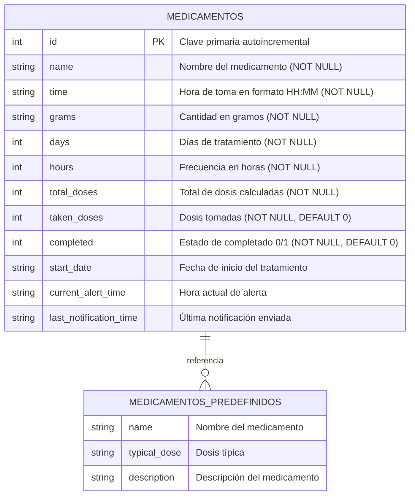

# Modelo Relacional - Aplicación de Medicamentos Sonnar

## Análisis de la Aplicación

La aplicación **Sonnar** es una aplicación móvil desarrollada en Kivy/KivyMD para el control y seguimiento de medicamentos. Permite a los usuarios registrar medicamentos, programar recordatorios y hacer seguimiento del progreso de sus tratamientos.

## Diagrama Entidad-Relación



## Modelo Relacional Detallado

### Tabla: MEDICAMENTOS

| Campo | Tipo | PK | FK | NOT NULL | UNIQUE | Índices | Descripción |
|-------|------|----|----|----------|--------|---------|-------------|
| `id` | INTEGER | ✓ | - | - | ✓ | PRIMARY KEY | Clave primaria autoincremental |
| `name` | TEXT | - | - | ✓ | - | idx_meds_name_time | Nombre del medicamento |
| `time` | TEXT | - | - | ✓ | - | idx_meds_name_time | Hora de toma (formato HH:MM) |
| `grams` | TEXT | - | - | ✓ | - | - | Cantidad en gramos |
| `days` | INTEGER | - | - | ✓ | - | - | Días de duración del tratamiento |
| `hours` | INTEGER | - | - | ✓ | - | - | Frecuencia de toma en horas |
| `total_doses` | INTEGER | - | - | ✓ | - | - | Total de dosis calculadas |
| `taken_doses` | INTEGER | - | - | ✓ | - | - | Dosis ya tomadas (DEFAULT: 0) |
| `completed` | INTEGER | - | - | ✓ | - | - | Estado completado 0/1 (DEFAULT: 0) |
| `start_date` | TEXT | - | - | - | - | - | Fecha de inicio (formato YYYY-MM-DD) |
| `current_alert_time` | TEXT | - | - | - | - | - | Hora actual de alerta |
| `last_notification_time` | TEXT | - | - | - | - | - | Última notificación enviada |

### Índices

1. **PRIMARY KEY**: `id` (AUTOINCREMENT)
2. **UNIQUE INDEX**: `idx_meds_name_time` en (`name`, `time`)
   - Evita duplicados lógicos de medicamentos con el mismo nombre y hora

### Tabla: MEDICAMENTOS_PREDEFINIDOS (Tabla lógica en código)

Esta tabla existe como una lista predefinida en el código Python (`MEDICATIONS_LIST`) y contiene medicamentos comunes con sus dosis típicas:

| Campo | Tipo | Descripción |
|-------|------|-------------|
| `name` | TEXT | Nombre del medicamento |
| `typical_dose` | TEXT | Dosis típica recomendada |
| `description` | TEXT | Descripción del medicamento |

## Reglas de Negocio

### 1. Cálculo de Dosis Totales
```python
total_doses = math.ceil((days * 24) / hours)
```

### 2. Restricciones de Integridad
- **Restricción de Unicidad**: No puede existir el mismo medicamento con la misma hora de toma
- **Validación de Hora**: Formato HH:MM válido
- **Validación de Días**: Debe ser un entero positivo
- **Validación de Horas**: Debe ser un entero positivo

### 3. Estados del Medicamento
- **Pendiente**: `completed = 0` y `taken_doses < total_doses`
- **En Progreso**: `completed = 0` y `taken_doses > 0`
- **Completado**: `completed = 1` o `taken_doses >= total_doses`

### 4. Sistema de Notificaciones
- **Hora Original**: `time` - Hora programada inicialmente
- **Hora de Alerta**: `current_alert_time` - Hora actual de notificación (puede ser retrasada)
- **Última Notificación**: `last_notification_time` - Control de duplicados

## Cardinalidades

- **MEDICAMENTOS**: 1:N (Un medicamento puede tener múltiples registros con diferentes horarios)
- **MEDICAMENTOS_PREDEFINIDOS**: 1:N (Un medicamento predefinido puede ser usado múltiples veces)

## Funcionalidades Principales

### 1. Gestión de Medicamentos
- Agregar medicamentos con validación
- Listar medicamentos con progreso visual
- Actualizar estado de dosis tomadas
- Eliminar medicamentos (implícito)

### 2. Sistema de Recordatorios
- Notificaciones automáticas cada minuto
- Opción de retrasar notificación 5 minutos
- Control de duplicados de notificaciones
- Cálculo automático de próxima dosis

### 3. Seguimiento de Progreso
- Barra de progreso visual
- Porcentaje de completado
- Dosis tomadas vs. totales
- Estado de retraso en notificaciones

## Consideraciones de Diseño

### Ventajas del Diseño Actual
1. **Simplicidad**: Una sola tabla principal
2. **Flexibilidad**: Permite múltiples horarios por medicamento
3. **Eficiencia**: Índices optimizados para consultas frecuentes
4. **Integridad**: Restricciones de unicidad lógica

### Posibles Mejoras
1. **Normalización**: Separar medicamentos de tratamientos
2. **Historial**: Tabla de eventos de toma
3. **Usuarios**: Sistema multi-usuario
4. **Categorías**: Clasificación de medicamentos
5. **Interacciones**: Alertas de interacciones medicamentosas

## Estructura de Archivos

```
backup/
├── main.py              # Lógica principal de la aplicación
├── medicamentos.kv      # Interfaz de usuario (Kivy)
├── medicamentos.db      # Base de datos SQLite
├── images/              # Recursos gráficos
│   ├── logo6.png
│   ├── pastilla.png
│   ├── pastilla2.png
│   └── reloj.png
└── diagrams/
    └── relational_model.md  # Este documento
```

## Conclusión

El modelo relacional actual es funcional y adecuado para una aplicación de seguimiento de medicamentos básica. La estructura de una sola tabla con restricciones de unicidad lógica permite un desarrollo rápido y mantenimiento sencillo, aunque podría beneficiarse de una normalización adicional para aplicaciones más complejas.
